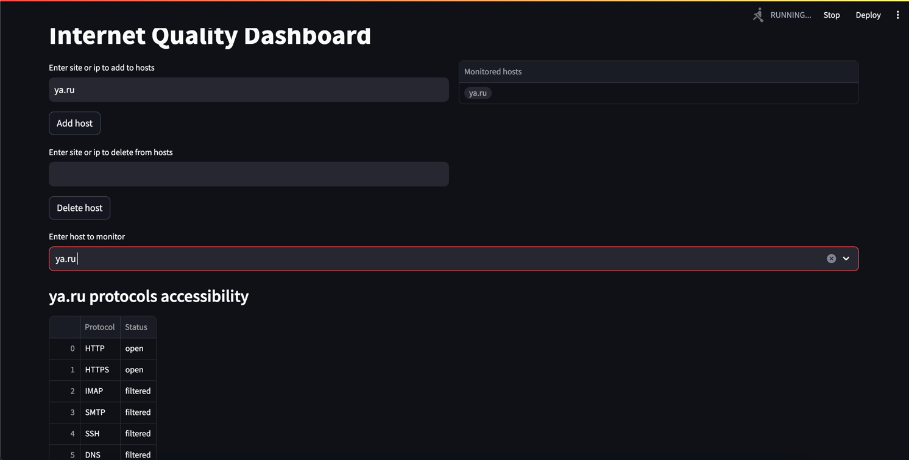
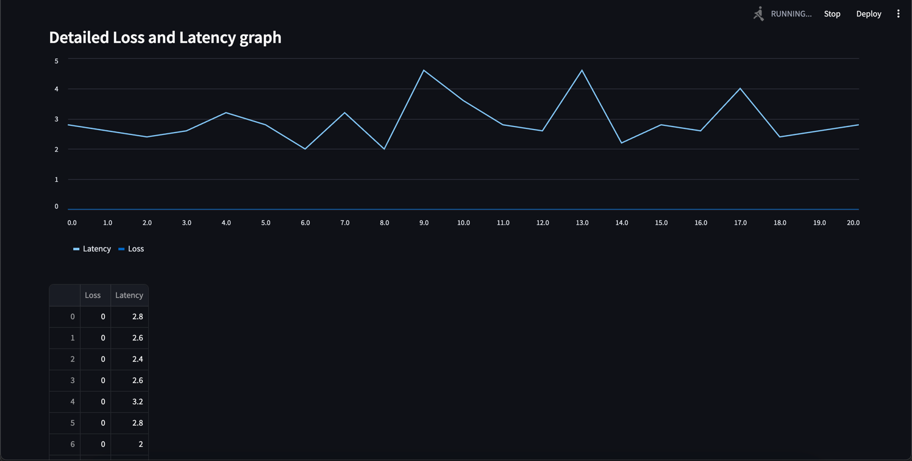

# InternetQualityMonitoring

## Project Description

The Internet Quality Monitoring project aims to provide a solution for tracking and visualizing internet quality indicators within a university campus environment. It helps identify and monitor issues such as packet loss, latency, and accessibility of various resources and protocols. The project includes a web dashboard for easy visualization of the collected data.

## Demo 





## How to Use (Deploy)

To deploy the Internet Quality Monitoring service, follow these steps:

1. Clone the repository: `git clone https://github.com/your_username/your_repository.git`
2. Navigate to the project directory: `cd internet-quality-monitoring`
3. Build the Docker image: `docker build -t internet-quality-monitoring .`
4. Run the Docker container: `docker run -p 8501:8501 internet-quality-monitoring`

The service will be accessible at `http://localhost:8501`.

## Technical Stack

The project is built using the following technologies:

- Python 3.11
- Streamlit for the web dashboard
- SQLite for database management
- Docker for containerization
- Ruff for code quality checks

## How to Develop

To contribute to the development of Internet Quality Monitoring, follow these steps:

1. Fork the repository on GitHub.
2. Clone your fork locally: `git clone https://github.com/your_username/your_repository.git`
3. Create a new branch for your feature: `git checkout -b feature-name`
4. Make your changes and commit them: `git commit -am 'Add new feature'`
5. Push your branch to your fork: `git push origin feature-name`
6. Submit a pull request on GitHub.

## Or run locally 

## Install

```bash
pip install poetry
poetry install
```

## Run

```bash
poetry run streamlit run frontend/app.py
```

## Testing 

Coverage testing

```bash
poetry run pytest --cov=backend/
```

Mutation testing

```bash
poetry run mutmut run --paths-to-mutate "backend/" --tests-dir "tests/"
poetry run mutmut show
```
